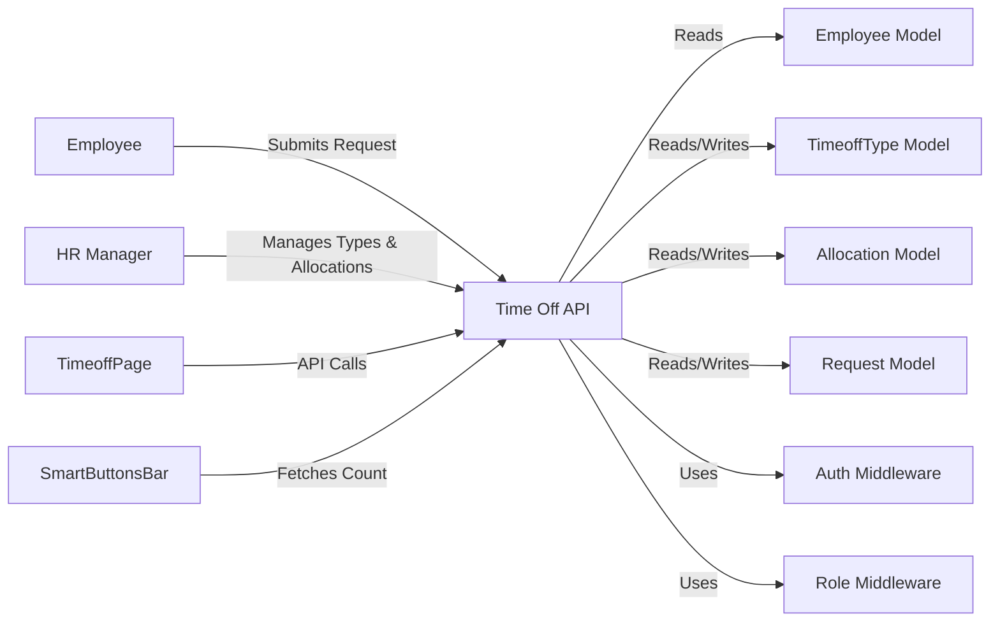
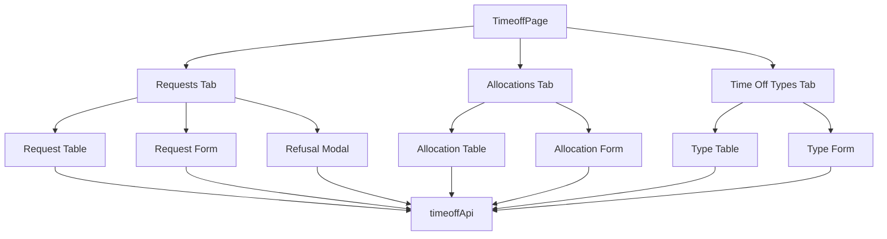
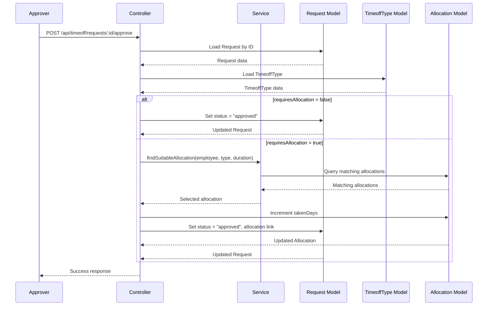
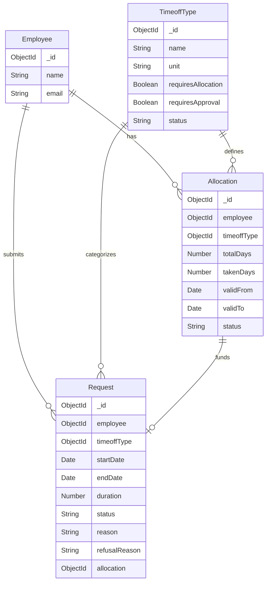

# Design Document: Time Off Management

## Overview

The Time Off Management feature provides a comprehensive system for managing employee time-off requests, allocations, and time-off types within the PeoplePay360 application. The system enables employees to submit time-off requests, HR managers to configure time-off policies and allocate balances, and approvers to review and process requests with automatic balance deduction.

### Core Components

**Backend Architecture:**
- **Data Layer**: Three Mongoose models (TimeoffType, Allocation, Request) managing time-off configuration, employee balances, and requests
- **Service Layer**: Business logic for duration computation, balance lookup, and allocation deduction
- **Controller Layer**: Request handlers with role-based access control and data scoping
- **Routes**: RESTful API endpoints mounted at `/api/timeoff`

**Frontend Architecture:**
- **API Client**: Wrapper module following the existing `apiRequest` pattern
- **Main UI**: Three-tab interface component (Requests, Allocations, Time Off Types)
- **Role-Based UI**: Conditional rendering based on user role (employee vs approver)
- **Navigation Integration**: SmartButtonsBar integration for employee detail pages

### Key Workflows

1. **Time Off Type Configuration**: HR managers create and configure time-off types with policies (requires allocation, requires approval)
2. **Allocation Management**: HR managers grant time-off balances to employees with validity periods
3. **Request Submission**: Employees submit time-off requests with date ranges
4. **Request Approval**: Approvers review requests and approve with automatic balance deduction or refuse with optional reason
5. **Balance Tracking**: System maintains accurate balance records through allocation deduction

## Architecture

### System Context

The Time Off Management feature integrates with existing PeoplePay360 components:



### Backend Architecture

**Layer Structure:**

1. **Routes Layer** (`timeoff.routes.js`): Maps HTTP endpoints to controllers with middleware chain
2. **Controller Layer** (`timeoff.controller.js`): Validates input, orchestrates service calls, formats responses
3. **Service Layer** (`timeoff.service.js`): Implements business logic for balance lookup and deduction
4. **Model Layer** (3 model files): Defines schemas, validations, and database interactions

**Middleware Chain:**

All endpoints follow the pattern:
```
HTTP Request → requireAuth → [requireRole] → Controller → Service → Model → Response
```

### Frontend Architecture

**Component Structure:**



**State Management:**

- Local component state for tab selection, form inputs, modals
- API calls trigger re-fetch to maintain consistency
- Role-based conditional rendering using `useAuth` context

### Data Flow

**Request Approval Flow (with balance deduction):**



## Components and Interfaces

### Backend Components

#### 1. TimeoffType Model

**File**: `Backend/src/features/timeoff/timeoffType.model.js`

**Schema**:
```javascript
{
  name: String (required, trimmed),
  unit: String (enum: ["days", "hours"], default: "days"),
  requiresAllocation: Boolean (default: true),
  requiresApproval: Boolean (default: true),
  status: String (enum: ["active", "archived"], default: "active"),
  timestamps: true
}
```

**Responsibilities**:
- Store time-off type configuration
- Enforce enum constraints for unit and status
- Provide default values for policy fields

**Indexes**: None required (small collection)

#### 2. Allocation Model

**File**: `Backend/src/features/timeoff/allocation.model.js`

**Schema**:
```javascript
{
  employee: ObjectId (ref: "Employee", required),
  timeoffType: ObjectId (ref: "TimeoffType", required),
  totalDays: Number (required, min: 0),
  takenDays: Number (default: 0, min: 0),
  validFrom: Date (default: null),
  validTo: Date (default: null),
  status: String (enum: ["pending", "approved"], default: "approved"),
  timestamps: true
}
```

**Virtual Fields**:
- `remainingDays`: Computed as `totalDays - takenDays`

**Responsibilities**:
- Store employee time-off balances
- Track usage via `takenDays`
- Support validity periods for time-bound allocations
- Provide computed `remainingDays` field

**Indexes**:
- `{ employee: 1, timeoffType: 1 }` for efficient balance lookup

#### 3. Request Model

**File**: `Backend/src/features/timeoff/request.model.js`

**Schema**:
```javascript
{
  employee: ObjectId (ref: "Employee", required),
  timeoffType: ObjectId (ref: "TimeoffType", required),
  startDate: Date (required),
  endDate: Date (required),
  duration: Number (computed server-side),
  status: String (enum: ["pending", "approved", "refused"], default: "pending"),
  reason: String (default: ""),
  refusalReason: String (default: null),
  allocation: ObjectId (ref: "Allocation", default: null),
  timestamps: true
}
```

**Responsibilities**:
- Store time-off requests with date ranges
- Track approval status
- Link to allocation used for balance deduction
- Store reason and refusalReason

**Indexes**:
- `{ employee: 1, status: 1 }` for efficient employee-specific queries
- `{ status: 1 }` for pending request queries

#### 4. Service Layer

**File**: `Backend/src/features/timeoff/timeoff.service.js`

**Functions**:

```javascript
/**
 * Computes inclusive day count between two dates
 * @param {Date} startDate - Start date
 * @param {Date} endDate - End date
 * @returns {number} Inclusive day count
 */
export function computeDuration(startDate, endDate)

/**
 * Finds suitable allocation for request approval
 * Prefers allocations with future/null validTo, earliest validFrom
 * @param {ObjectId} employeeId - Employee ID
 * @param {ObjectId} timeoffTypeId - TimeoffType ID
 * @param {number} duration - Required duration
 * @returns {Promise<Allocation|null>} Suitable allocation or null
 */
export async function findSuitableAllocation(employeeId, timeoffTypeId, duration)
```

**Responsibilities**:
- Encapsulate duration computation logic
- Implement allocation selection algorithm
- Decouple business logic from controllers

#### 5. Controller Layer

**File**: `Backend/src/features/timeoff/timeoff.controller.js`

**Handlers**:

```javascript
// Time Off Types
export async function getTimeoffTypes(req, res)  // GET /api/timeoff/types?status=active
export async function createTimeoffType(req, res)  // POST /api/timeoff/types
export async function updateTimeoffType(req, res)  // PUT /api/timeoff/types/:id

// Allocations
export async function getAllocations(req, res)  // GET /api/timeoff/allocations?employee=:id
export async function createAllocation(req, res)  // POST /api/timeoff/allocations

// Requests
export async function getRequests(req, res)  // GET /api/timeoff/requests?status=pending
export async function createRequest(req, res)  // POST /api/timeoff/requests
export async function approveRequest(req, res)  // POST /api/timeoff/requests/:id/approve
export async function refuseRequest(req, res)  // POST /api/timeoff/requests/:id/refuse
```

**Responsibilities**:
- Validate input parameters
- Enforce role-based data scoping (employees see only their own data)
- Orchestrate service layer calls
- Format responses using `ApiResponse`
- Handle errors with `ApiError`

**Access Control Patterns**:

For GET endpoints:
- **Employees**: Filter by `req.user.employee` (own data only)
- **Approvers**: Accept query parameter filtering, return all matching records

For POST endpoints:
- **Employees**: Set `employee` field to `req.user.employee`
- **Approvers**: Require `employee` field in request body

#### 6. Routes

**File**: `Backend/src/features/timeoff/timeoff.routes.js`

**Route Definitions**:

```javascript
// Time Off Types
router.get("/types", requireAuth, getTimeoffTypes)
router.post("/types", requireAuth, requireRole("admin", "hr_manager"), createTimeoffType)
router.put("/types/:id", requireAuth, requireRole("admin", "hr_manager"), updateTimeoffType)

// Allocations
router.get("/allocations", requireAuth, getAllocations)
router.post("/allocations", requireAuth, requireRole("admin", "hr_manager"), createAllocation)

// Requests
router.get("/requests", requireAuth, getRequests)
router.post("/requests", requireAuth, createRequest)
router.post("/requests/:id/approve", requireAuth, requireRole("admin", "hr_manager"), approveRequest)
router.post("/requests/:id/refuse", requireAuth, requireRole("admin", "hr_manager"), refuseRequest)
```

**Integration**: Router exported as default and mounted in `Backend/src/app.js` at `/api/timeoff`

### Frontend Components

#### 1. API Client Module

**File**: `Frontend/src/features/timeoff/timeoffApi.js`

**Functions**:

```javascript
// Time Off Types
export function getTimeoffTypes(filters = {})
export function createTimeoffType(input)
export function updateTimeoffType(id, input)

// Allocations
export function getAllocations(filters = {})
export function createAllocation(input)

// Requests
export function getRequests(filters = {})
export function createRequest(input)
export function approveRequest(id)
export function refuseRequest(id, reason)
```

**Pattern**: All functions use `apiRequest` wrapper with:
- Query parameters via `URLSearchParams` for GET requests
- JSON body for POST/PUT requests
- Automatic credential inclusion
- Error handling via thrown exceptions

#### 2. TimeoffPage Component

**File**: `Frontend/src/features/timeoff/TimeoffPage.jsx`

**Structure**:

```jsx
export default function TimeoffPage() {
  const { user } = useAuth()
  const [activeTab, setActiveTab] = useState("requests")
  const isApprover = user?.role === "admin" || user?.role === "hr_manager"
  
  return (
    <main className="app-shell">
      <header className="page-header">...</header>
      <nav className="tabs">
        <button onClick={() => setActiveTab("requests")}>Requests</button>
        <button onClick={() => setActiveTab("allocations")}>Allocations</button>
        <button onClick={() => setActiveTab("types")}>Time Off Types</button>
      </nav>
      {activeTab === "requests" && <RequestsTab isApprover={isApprover} />}
      {activeTab === "allocations" && <AllocationsTab isApprover={isApprover} />}
      {activeTab === "types" && <TypesTab isApprover={isApprover} />}
    </main>
  )
}
```

**State Management**:
- Active tab selection
- Delegated data fetching to child tabs
- Role detection from auth context

#### 3. RequestsTab Component

**File**: Inline in `TimeoffPage.jsx` or extracted

**Features**:
- **Employee View**: Request form + own requests table
- **Approver View**: All requests table with approve/refuse actions
- **Request Form**: Type selector, date range, reason textarea
- **Refusal Modal**: Triggered on refuse button click, optional reason input

**Data Flow**:
- Fetch requests on mount via `getRequests()`
- Employee-specific filtering handled by backend
- Re-fetch after create/approve/refuse operations

#### 4. AllocationsTab Component

**File**: Inline in `TimeoffPage.jsx` or extracted

**Features**:
- **Employee View**: Read-only allocation table
- **Approver View**: Allocation table + creation form
- **Allocation Form**: Employee selector, type selector, totalDays input, validity date range
- **Table Columns**: Employee, Type, Total, Taken, Remaining, Valid from, Valid to

**Data Flow**:
- Fetch allocations on mount via `getAllocations()`
- Computed `remainingDays` field displayed from backend response
- Re-fetch after allocation creation

#### 5. TypesTab Component

**File**: Inline in `TimeoffPage.jsx` or extracted

**Features**:
- **All Users**: View time-off types table
- **Approvers Only**: Type creation and edit forms
- **Type Form**: Name input, unit select, requiresAllocation checkbox, requiresApproval checkbox, status select
- **Table Columns**: Name, Unit, Requires allocation, Requires approval, Status

**Data Flow**:
- Fetch types on mount via `getTimeoffTypes()`
- Re-fetch after create/update operations

#### 6. SmartButtonsBar Integration

**File**: `Frontend/src/common/components/SmartButtonsBar.jsx` (modified)

**Integration**:

Add "Time Off" button when viewing employee detail:

```jsx
const [timeoffCount, setTimeoffCount] = useState(null)

useEffect(() => {
  if (employeeId) {
    getRequests({ employee: employeeId })
      .then(requests => setTimeoffCount(requests.length))
      .catch(() => setTimeoffCount(null))
  }
}, [employeeId])

return (
  <div className="smart-buttons-bar">
    {/* ... existing buttons ... */}
    <button onClick={() => navigate(`/timeoff?employee=${employeeId}`)}>
      Time Off {timeoffCount !== null && `(${timeoffCount})`}
    </button>
  </div>
)
```

## Data Models

### Database Schema

#### TimeoffType Collection

```javascript
{
  _id: ObjectId,
  name: "Annual Leave",
  unit: "days",
  requiresAllocation: true,
  requiresApproval: true,
  status: "active",
  createdAt: ISODate("2024-01-15T10:00:00Z"),
  updatedAt: ISODate("2024-01-15T10:00:00Z")
}
```

**Constraints**:
- `name` is required and trimmed
- `unit` must be "days" or "hours"
- `status` must be "active" or "archived"
- Defaults provided for all boolean and enum fields

#### Allocation Collection

```javascript
{
  _id: ObjectId,
  employee: ObjectId("507f1f77bcf86cd799439011"),
  timeoffType: ObjectId("507f1f77bcf86cd799439012"),
  totalDays: 20,
  takenDays: 5,
  validFrom: ISODate("2024-01-01T00:00:00Z"),
  validTo: ISODate("2024-12-31T23:59:59Z"),
  status: "approved",
  createdAt: ISODate("2024-01-15T10:00:00Z"),
  updatedAt: ISODate("2024-03-10T14:30:00Z")
}
```

**Computed Fields** (added to API responses):
- `remainingDays: 15` (totalDays - takenDays)

**Constraints**:
- `employee` and `timeoffType` are required references
- `totalDays` must be >= 0
- `takenDays` must be >= 0
- `validFrom` and `validTo` are optional (null means no constraint)

#### Request Collection

```javascript
{
  _id: ObjectId,
  employee: ObjectId("507f1f77bcf86cd799439011"),
  timeoffType: ObjectId("507f1f77bcf86cd799439012"),
  startDate: ISODate("2024-06-10T00:00:00Z"),
  endDate: ISODate("2024-06-14T00:00:00Z"),
  duration: 5,
  status: "approved",
  reason: "Family vacation",
  refusalReason: null,
  allocation: ObjectId("507f1f77bcf86cd799439013"),
  createdAt: ISODate("2024-05-01T09:00:00Z"),
  updatedAt: ISODate("2024-05-02T11:30:00Z")
}
```

**Constraints**:
- `employee`, `timeoffType`, `startDate`, `endDate` are required
- `duration` is computed server-side on creation
- `status` must be "pending", "approved", or "refused"
- `refusalReason` is only set when status is "refused"
- `allocation` links to the allocation used for balance deduction (null for non-allocation types)

### Data Relationships



### Business Logic Algorithms

#### Duration Computation

```javascript
function computeDuration(startDate, endDate) {
  const msPerDay = 86400000  // 24 * 60 * 60 * 1000
  return Math.round((endDate - startDate) / msPerDay) + 1
}
```

**Rationale**: Inclusive count (both startDate and endDate count as 1 day each)

**Example**:
- Start: June 10, End: June 14
- Difference: 4 days (14 - 10)
- Inclusive: 5 days (10, 11, 12, 13, 14)

#### Suitable Allocation Selection

**Algorithm**:

1. Query allocations matching:
   - `employee` equals request employee
   - `timeoffType` equals request type
   - `status` equals "approved"
   - `remainingDays >= duration`

2. Filter allocations with valid date ranges:
   - If `validFrom` is set, must be <= request startDate
   - If `validTo` is set, must be >= request endDate

3. Sort by preference:
   - Primary: `validTo` null or in future (prioritize non-expiring)
   - Secondary: Earliest `validFrom` (use oldest first)

4. Select first matching allocation

**Pseudocode**:

```javascript
async function findSuitableAllocation(employeeId, timeoffTypeId, duration) {
  const allocations = await Allocation.find({
    employee: employeeId,
    timeoffType: timeoffTypeId,
    status: "approved",
    $expr: { $gte: [{ $subtract: ["$totalDays", "$takenDays"] }, duration] }
  }).sort({ validTo: 1, validFrom: 1 })
  
  const now = new Date()
  for (const allocation of allocations) {
    if (allocation.validFrom && allocation.validFrom > now) continue
    if (allocation.validTo && allocation.validTo < now) continue
    return allocation
  }
  
  return null
}
```

## Error Handling

### Backend Error Patterns

#### Validation Errors (400 Bad Request)

**Triggers**:
- Invalid ObjectId format
- `endDate` before `startDate`
- Missing required fields
- Invalid enum values
- Request status not "pending" when attempting approval/refusal
- Insufficient leave balance

**Response Format**:
```json
{
  "success": false,
  "statusCode": 400,
  "message": "endDate must be after startDate",
  "errors": [],
  "data": null
}
```

#### Authorization Errors (403 Forbidden)

**Triggers**:
- Employee attempting to create allocation
- Employee attempting to approve/refuse request
- User lacking required role for endpoint

**Response Format**:
```json
{
  "success": false,
  "statusCode": 403,
  "message": "Insufficient permissions",
  "errors": [],
  "data": null
}
```

#### Not Found Errors (404)

**Triggers**:
- Request ID not found when approving/refusing
- Referenced employee not found when creating allocation
- Referenced timeoffType not found when creating request/allocation

**Response Format**:
```json
{
  "success": false,
  "statusCode": 404,
  "message": "Request not found",
  "errors": [],
  "data": null
}
```

#### Conflict Errors (409)

**Triggers**:
- Attempting to approve already approved/refused request
- Database unique constraint violations (if any)

**Response Format**:
```json
{
  "success": false,
  "statusCode": 409,
  "message": "Request has already been processed",
  "errors": [],
  "data": null
}
```

### Frontend Error Handling

**Pattern**: All API functions throw errors on non-2xx responses

```javascript
try {
  await approveRequest(requestId)
  setError("")
  loadRequests()  // Re-fetch
} catch (err) {
  setError(err.message)
}
```

**User Feedback**:
- Display error messages in component state
- Show inline error text below forms or at top of page
- Clear errors on successful operations

### Edge Cases

1. **Request spans allocation validity period**: Request denied if allocation expires during request period
2. **Multiple allocations available**: Algorithm selects non-expiring allocations first, then earliest
3. **Partial balance**: Request denied if any allocation has insufficient remainingDays
4. **Deleted employee**: Requests remain in system with populated employee data from time of creation
5. **Archived time-off type**: Existing requests remain valid, new requests should validate against active types only
6. **Negative duration**: Prevented by validation (`endDate` must be >= `startDate`)
7. **Time zones**: All dates stored as UTC, displayed in user's local timezone (frontend responsibility)

## Testing Strategy

### Property-Based Testing Applicability Assessment

This feature involves:
- **Backend business logic**: Duration computation, allocation selection algorithm
- **CRUD operations**: Database reads/writes with validation
- **Role-based access control**: Middleware-enforced permissions
- **API integration**: HTTP request/response handling
- **UI rendering**: React components with forms and tables

**PBT IS appropriate for**:
- Duration computation function (pure function with clear mathematical properties)
- Allocation selection algorithm (deterministic logic with sortable properties)

**PBT IS NOT appropriate for**:
- CRUD operations (simple database interactions with no complex transformation logic)
- Role-based access control (configuration-based middleware, not algorithmic)
- UI rendering (visual components, better suited for snapshot/integration tests)
- API integration (endpoint behavior better tested with example-based integration tests)

**Decision**: PBT will be applied selectively to the service layer functions with universal properties. The majority of the feature will use example-based unit tests and integration tests.

### Unit Testing

**Backend Tests**:

1. **Service Layer** (`timeoff.service.test.js`):
   - `computeDuration()`: Example-based tests for various date ranges, property-based tests for mathematical properties
   - `findSuitableAllocation()`: Example-based tests with mocked allocation data, edge cases for validity periods

2. **Controller Layer** (`timeoff.controller.test.js`):
   - Each controller function with mocked models and services
   - Role-based data scoping verification
   - Error scenarios (invalid input, missing records, insufficient permissions)

3. **Model Layer**:
   - Schema validation (required fields, enum constraints, min values)
   - Virtual field computation (remainingDays)
   - Default value application

**Frontend Tests**:

1. **API Client** (`timeoffApi.test.js`):
   - Function signature correctness
   - Query parameter formatting
   - Request body serialization
   - Mock `apiRequest` wrapper

2. **Components**:
   - Role-based rendering (employee vs approver views)
   - Form submission handlers
   - Tab switching logic
   - Modal interactions

**Test Framework**: Jest for both backend and frontend

**Coverage Target**: 80% line coverage minimum

### Integration Testing

**Backend Integration Tests**:

1. **End-to-End Request Flow**:
   - Create time-off type → Create allocation → Create request → Approve request
   - Verify balance deduction
   - Verify request status updates

2. **Role-Based Access**:
   - Employee can only see own requests/allocations
   - Approver can see all records
   - Unauthorized operations return 403

3. **Error Scenarios**:
   - Approve request with insufficient balance
   - Refuse already approved request
   - Create allocation for non-existent employee

**Frontend Integration Tests**:

1. **User Workflows**:
   - Employee submits request and sees it in requests table
   - Approver approves request and sees status update
   - HR manager creates allocation and sees it in allocations table

2. **Navigation**:
   - SmartButtonsBar "Time Off" button navigates to correct page
   - Tab switching preserves data state

**Test Framework**: Supertest for backend API tests, React Testing Library for frontend component tests

### Property-Based Testing

PBT will be applied to service layer functions with universal properties.

**Test Library**: fast-check (JavaScript property-based testing library)

**Test Configuration**: Minimum 100 iterations per property test

**Properties to Test**:

#### Service Layer Properties

1. **Duration Computation Properties**:
   - **Property 1**: For any valid date range where `endDate >= startDate`, duration is always >= 1
   - **Property 2**: For any date and positive integer n, the duration from date to (date + n days) equals n + 1
   - **Property 3**: Duration computation is commutative in sign: `duration(a, b) = -duration(b, a) + 2` (accounting for inclusivity)

2. **Allocation Selection Properties**:
   - **Property 4**: For any set of allocations with sufficient balance, `findSuitableAllocation` returns an allocation with `remainingDays >= duration`
   - **Property 5**: For any set of allocations, if one has `validTo = null` and others have `validTo` set, the null allocation is preferred
   - **Property 6**: For any set of allocations with same `validTo`, the one with earliest `validFrom` is selected

**Note**: Properties 4-6 will use generated mock allocation data rather than database queries to keep tests fast and deterministic.

### Manual Testing

**Test Scenarios**:

1. **End-User Workflows**:
   - Employee requests time off and receives approval
   - Employee requests time off and receives refusal with reason
   - HR manager configures new time-off type and creates allocations

2. **UI Responsiveness**:
   - Forms validate input and show clear error messages
   - Tables load and display data correctly
   - Modals open and close as expected

3. **Cross-Browser Testing**:
   - Chrome, Firefox, Safari
   - Mobile responsive design

### Test Data

**Seed Data Requirements**:
- At least 3 time-off types (Annual Leave, Sick Leave, Personal Day)
- At least 5 employees with varying allocations
- Mix of pending, approved, and refused requests
- Allocations with different validity periods (current, future, expired)

**Database Reset**: Between integration test suites to ensure clean state

---

This design document provides the technical architecture, component specifications, and testing strategy for implementing the Time Off Management feature in PeoplePay360. The implementation should follow the patterns established in the existing codebase (e.g., attendance, employees features) while adhering to the specific requirements outlined in the requirements document.
