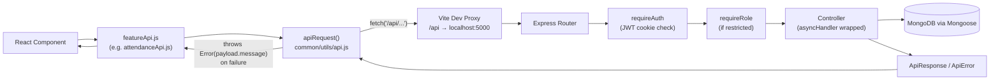
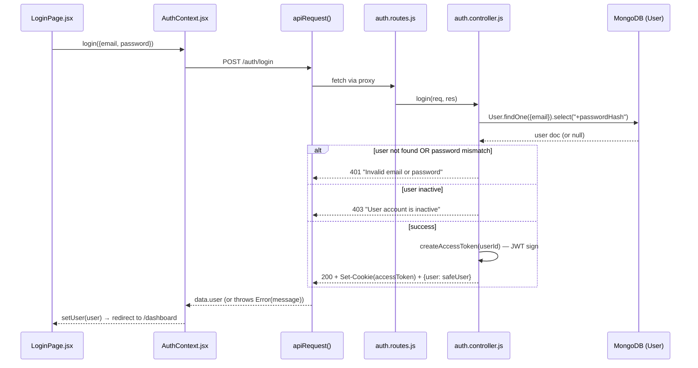
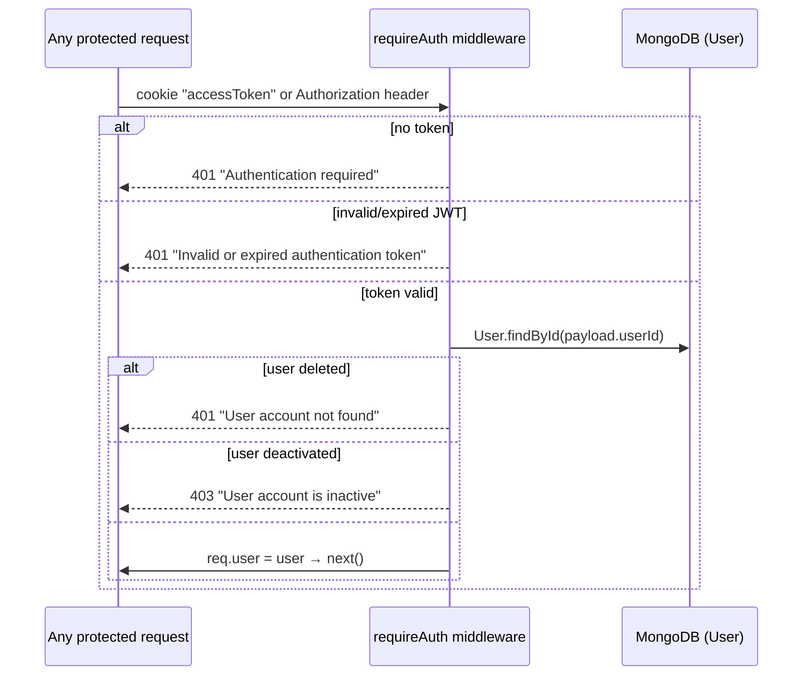
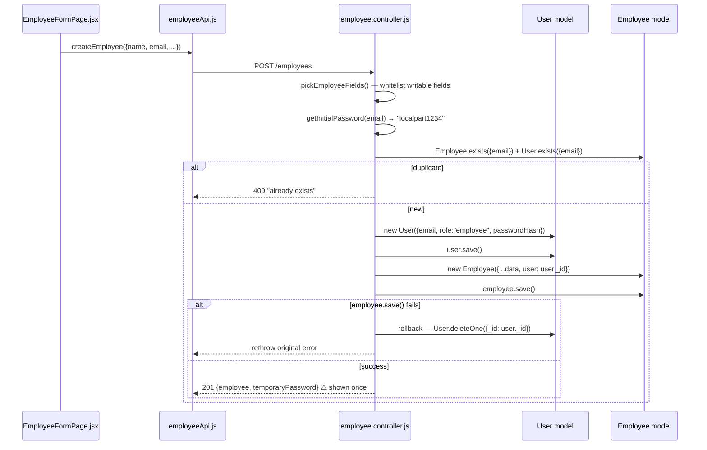
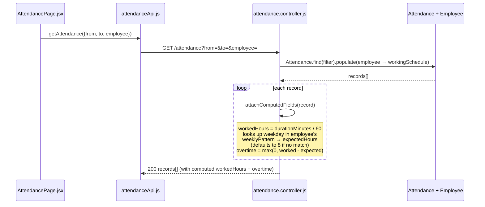
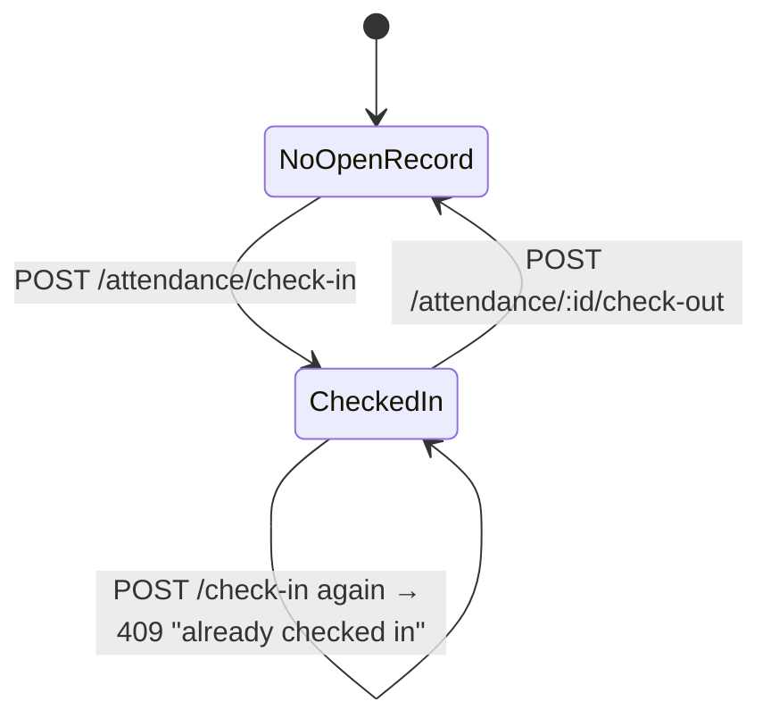
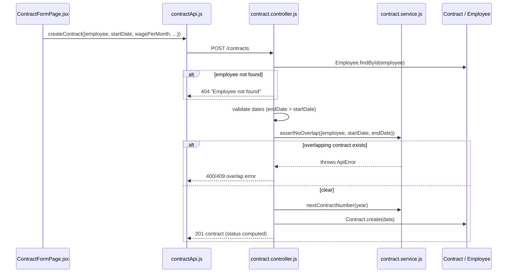
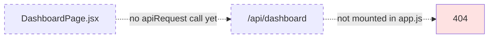
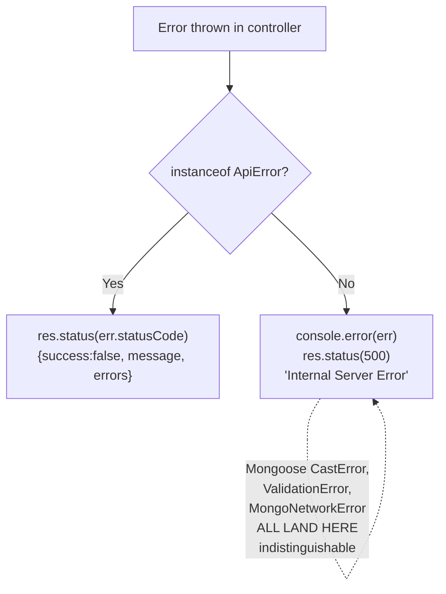

# PeoplePay360 — Frontend ↔ Backend Data Flow

This document maps every implemented feature's request/response flow, the
key functions involved, and how failures are (or aren't) surfaced. Diagrams
use Mermaid — GitHub renders these natively when this file is viewed in the
repo, no plugin needed.

**Suggested location:** `Backend/src/routes/DATA_FLOW.md` or repo root.

---

## Legend

| Symbol | Meaning |
|---|---|
| ✅ | Fully implemented, working end-to-end |
| ❌ | Stub only — `// TODO`, not wired up |
| 🔒 | Requires authentication (`requireAuth`) |
| 🛡️ | Requires specific role (`requireRole`) |

---

## Architecture overview



**Response contract (every endpoint, success or failure):**
```
Success → { success: true,  data: {...}, message: "..." }
Failure → { success: false, data: null,  message: "...", errors: [...] }
```
`apiRequest()` unwraps this automatically: returns `payload.data` on success,
throws `new Error(payload.message)` on failure. Components only ever see a
resolved value or a caught `Error`.

---

## 1. Auth ✅



**Every subsequent request** re-validates via `requireAuth`:


| Function | Input | Output | Failure cases |
|---|---|---|---|
| `login` | `{email, password}` | `{user}` + httpOnly cookie | 400 missing fields · 401 bad credentials · 403 inactive |
| `me` 🔒 | cookie only | `{user}` | 401 if token invalid |
| `logout` 🔒 | — | clears cookie | — |

---

## 2. Employees ✅



⚠️ **`temporaryPassword` is returned once, in plaintext, and never stored.**
Confirm `EmployeeFormPage.jsx` displays/copies it immediately — if a user
navigates away before reading it, it's unrecoverable without calling
`resetEmployeeCredentials`.

| Function | Input | Output | Failure cases |
|---|---|---|---|
| `getEmployees` | query: `department`, `status`, `employeeType` | `Employee[]` (populated) | — |
| `createEmployee` | employee fields | `{employee, temporaryPassword}` | 400 missing name/email · 409 duplicate |
| `resetEmployeeCredentials` | `:id` | `{email, temporaryPassword}` | 404 no employee / no linked account |
| `updateEmployee` | `:id` + partial fields | updated `Employee` | 400 no fields · 404 · 409 duplicate |
| `deactivateEmployee` / `reactivateEmployee` | `:id` | updated `Employee` | 404 |

---

## 3. Attendance ✅



**Check-in state machine:**


Overtime is **computed on every read, not stored** — if an employee's
schedule changes today, past attendance records recalculate overtime
against the new schedule next time they're fetched.

| Function | Input | Output | Failure cases |
|---|---|---|---|
| `getAttendance` 🔒 | query filters | `record[]` w/ computed fields | employees see only their own |
| `checkIn` 🔒 | `{employee, source, notes}` | `201 record` | 409 already checked in · 404 inactive employee |
| `checkOut` 🔒 | `:id` | `200 record` | 404 no open record · 403 not your record |
| `correctAttendance` 🔒🛡️ admin/hr_manager | `{checkIn, checkOut, notes}` | `200 record` | 400 checkOut before checkIn |

---

## 4. Contracts ✅



`resolveStatus()` derives `running` / `expired` **dynamically** from
`startDate`/`endDate` vs. now — status is never stored, so it can't go stale.

| Function | Input | Output | Failure cases |
|---|---|---|---|
| `getContracts` | query: `employee`, `status` | `Contract[]` w/ computed status | employees see only their own |
| `createContract` | employee, dates, wage, etc. | `201 contract` | 400 missing fields/bad dates · 404 employee · overlap error |
| `updateContract` | `:id` + partial fields | `200 contract` | 400 no fields · 404 · overlap error |

---

## 5. Time Off ✅ (most business-logic-heavy flow)

```mermaid
sequenceDiagram
    participant U as TimeoffPage.jsx
    participant API as timeoffApi.js
    participant C as timeoff.controller.js
    participant Svc as timeoff.service.js
    participant DB as Request / Allocation / TimeoffType

    U->>API: approveRequest(id)
    API->>C: POST /timeoff/requests/:id/approve
    C->>DB: Request.findById(id) — must be "pending"
    C->>DB: TimeoffType.findById(request.timeoffType)
    alt type.requiresAllocation === false
        C->>DB: request.status = "approved"; save()
        C-->>API: 200 approved (no balance touched)
    else requires allocation
        C->>Svc: findSuitableAllocation(employee, type, duration)
        Svc->>DB: Allocation.find({...}) with $expr balance check,<br/>sorted by soonest-expiring first
        Svc->>Svc: filter by validFrom/validTo in JS
        alt no suitable allocation
            Svc-->>C: null
            C-->>API: 400 "Insufficient leave balance"
        else found
            C->>DB: allocation.takenDays += duration
            C->>DB: request.status = "approved"; request.allocation = alloc._id
            par not a real transaction
                C->>DB: allocation.save()
                C->>DB: request.save()
            end
            C-->>API: 200 approved request
        end
    end
```

⚠️ **`Promise.all([allocation.save(), request.save()])` is not an atomic
Mongo transaction.** If `allocation.save()` succeeds and `request.save()`
throws, the balance is deducted but the request never shows approved — a
silent inconsistency with no dedicated error surfaced for it. Wrapping this
in a Mongoose session/transaction would close the gap.

| Function | Input | Output | Failure cases |
|---|---|---|---|
| `createRequest` 🔒 | `{timeoffType, startDate, endDate, reason}` | `201 request` | 400 missing fields · 404 type not found |
| `approveRequest` 🔒 | `:id` | `200 request` | 400 not pending / insufficient balance · 404 |
| `refuseRequest` 🔒 | `:id`, `{refusalReason}` | `200 request` | 400 not pending · 404 |
| `createAllocation` 🔒 | `{employee, timeoffType, totalDays, ...}` | `201 allocation` | 400 missing fields · 404 employee/type |

---

## 6. Dashboard ❌ — Payroll ❌ (not implemented)

Every file in both feature folders is a stub:
```js
// dashboard.controller.js
// TODO: Implement dashboard request handlers.
export {};
```
Same pattern in `dashboard.aggregation.service.js`, `payroll.routes.js`,
`payrun.controller.js`, `payslip.controller.js`, `ruleEngine.service.js`,
`pdf.service.js`, `email.service.js`, `payrun.model.js`, `payslip.model.js`,
`salaryRule.model.js`, `salaryStructure.model.js`. Neither router is
imported into `app.js`, so `/api/dashboard` and `/api/payroll` currently
404. `DashboardPage.jsx` and `PayrollPage.jsx` are placeholder components
with no `apiRequest` calls at all.



**This needs a full-stack build, not just a frontend task**: aggregation
queries + controller + route mounting on the backend, then a frontend page
that actually calls them.

---

## Error-handling reference (current state)



**Gap:** only manually-thrown `ApiError`s get specific status/message.
Mongoose `CastError`, `ValidationError`, duplicate-key errors (outside the
few controllers that catch `code === 11000` locally), and DB connectivity
errors all fall into the generic 500 branch with the same flat message —
the frontend cannot currently tell "bad input," "duplicate record," and
"database is down" apart from each other.

`Backend/src/common/middleware/error.middleware.js` is a stub intended to
hold this logic centrally — it currently just does:
```js
// TODO: Centralize application error handling.
export {};
```
The real handling lives inline at the bottom of `app.js` instead.

**Recommended fix** — flesh out `error.middleware.js` and import it into
`app.js`:
```js
export function errorHandler(err, req, res, next) {
  if (err instanceof ApiError) {
    return res.status(err.statusCode).json({ success: false, message: err.message, errors: err.errors, data: null });
  }
  if (err.name === "CastError") {
    return res.status(400).json({ success: false, message: `Invalid ${err.path}: ${err.value}` });
  }
  if (err.name === "ValidationError") {
    return res.status(400).json({ success: false, message: Object.values(err.errors).map(e => e.message).join(", ") });
  }
  if (err.code === 11000) {
    return res.status(409).json({ success: false, message: "Duplicate value violates a unique constraint" });
  }
  if (err.name === "MongooseServerSelectionError" || err.name === "MongoNetworkError") {
    console.error("Database connectivity error:", err);
    return res.status(503).json({ success: false, message: "Database temporarily unavailable — please try again shortly" });
  }
  console.error("Unhandled error:", err);
  return res.status(500).json({ success: false, message: "Internal Server Error" });
}
```

---

## UI error-display coverage

| Page | Fetches data? | Shows loading state? | Shows errors? |
|---|---|---|---|
| Login | ✅ | ✅ (`submitting`) | ✅ |
| Attendance | ✅ | ❌ | ✅ |
| Employees | ✅ | — | — (not verified in this pass) |
| Contracts | ✅ | — | — (not verified in this pass) |
| Time Off | ✅ | — | — (not verified in this pass) |
| Dashboard | ❌ | — | — |
| Payroll | ❌ | — | — |

**Standard pattern to apply consistently** (especially for the Dashboard
build):
```jsx
const [data, setData] = useState(null);
const [error, setError] = useState("");
const [loading, setLoading] = useState(true);

useEffect(() => {
  setLoading(true);
  getDashboardData(filters)
    .then(setData)
    .catch((err) => setError(err.message))
    .finally(() => setLoading(false));
}, [filters]);

if (loading) return <Spinner />;
if (error) return <ErrorBanner message={error} onRetry={load} />;
```

---

## Implementation status summary

| Module | Backend | Frontend | Status |
|---|---|---|---|
| Auth | ✅ | ✅ | Working end-to-end |
| Employees | ✅ | ✅ | Working end-to-end |
| Attendance | ✅ | ✅ | Working end-to-end |
| Contracts | ✅ | ✅ | Working end-to-end |
| Schedules | ✅ | ✅ | Working end-to-end |
| Time Off | ✅ | ✅ | Working end-to-end |
| Users | ✅ | — | Backend ready, no dedicated page found |
| Dashboard | ❌ | ❌ | Not built |
| Payroll | ❌ | ❌ | Not built |